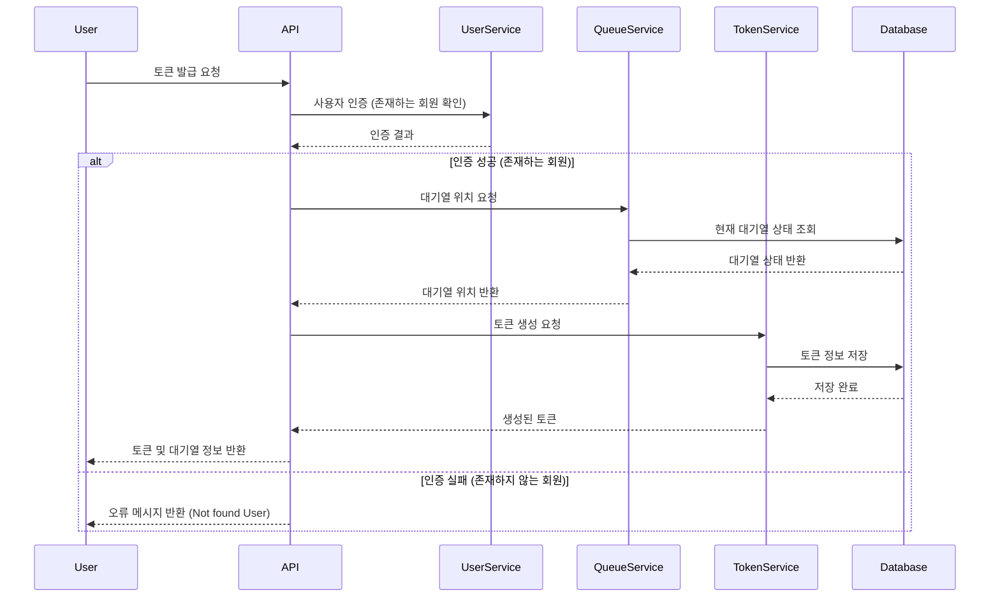
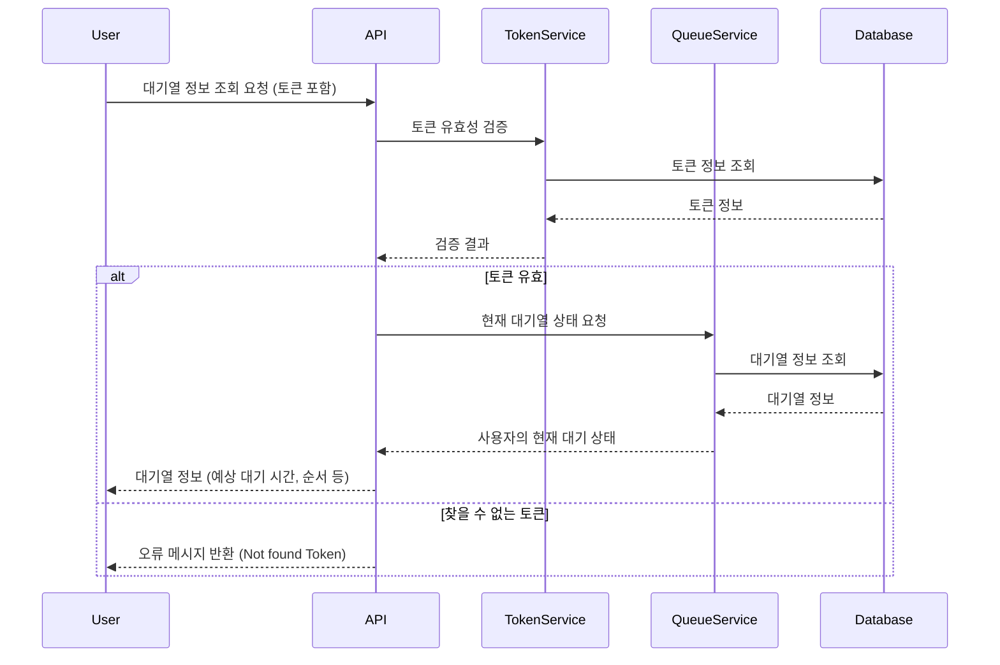
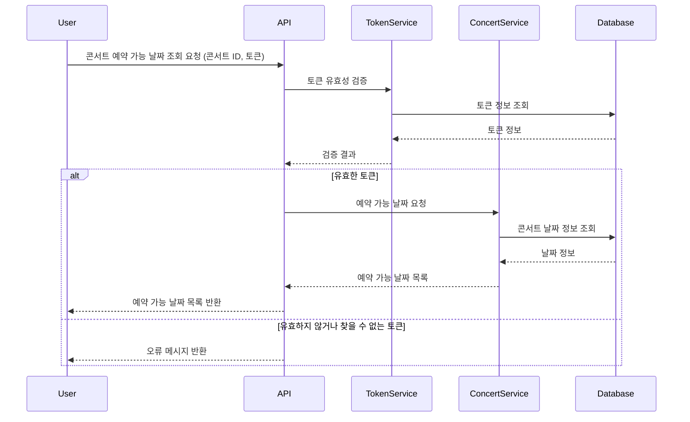
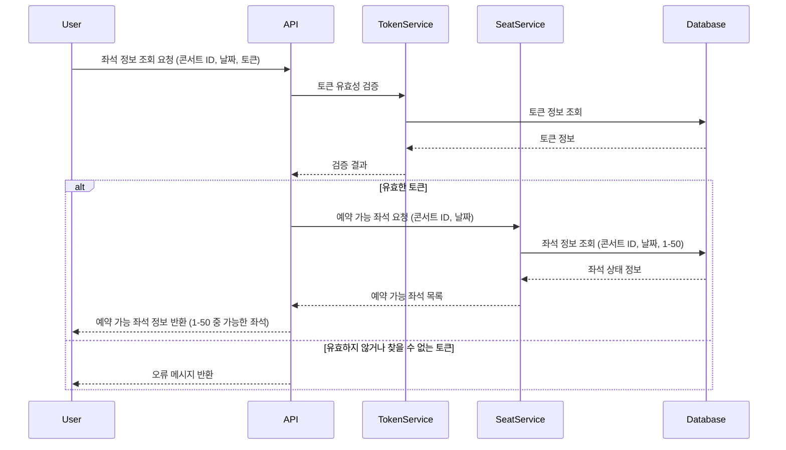
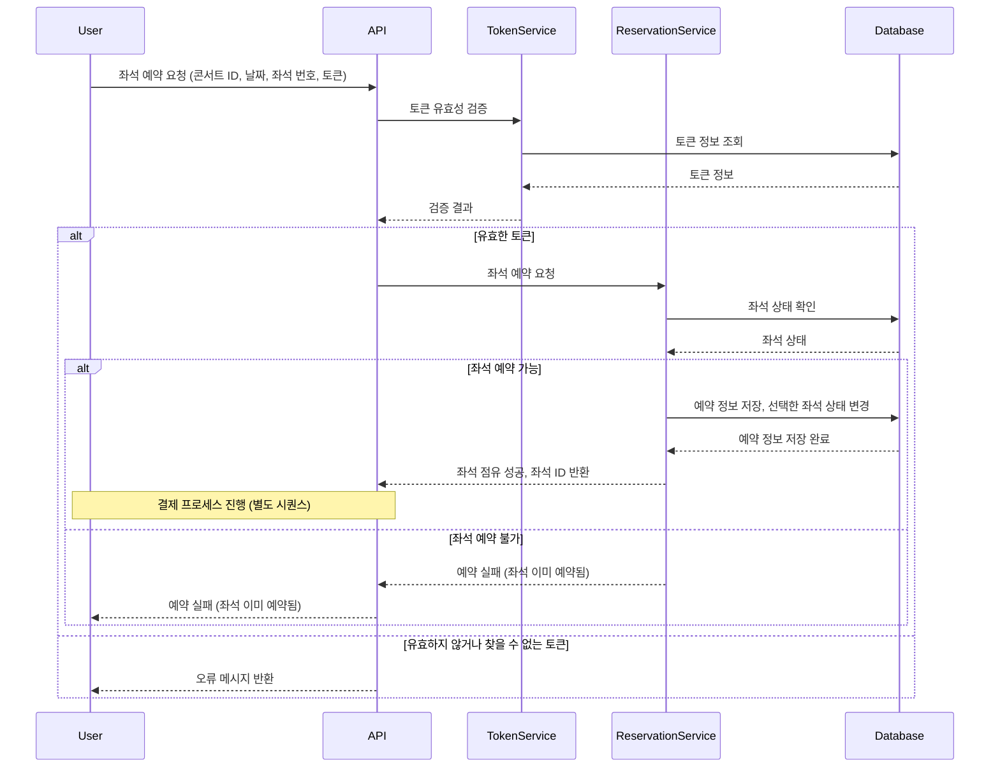
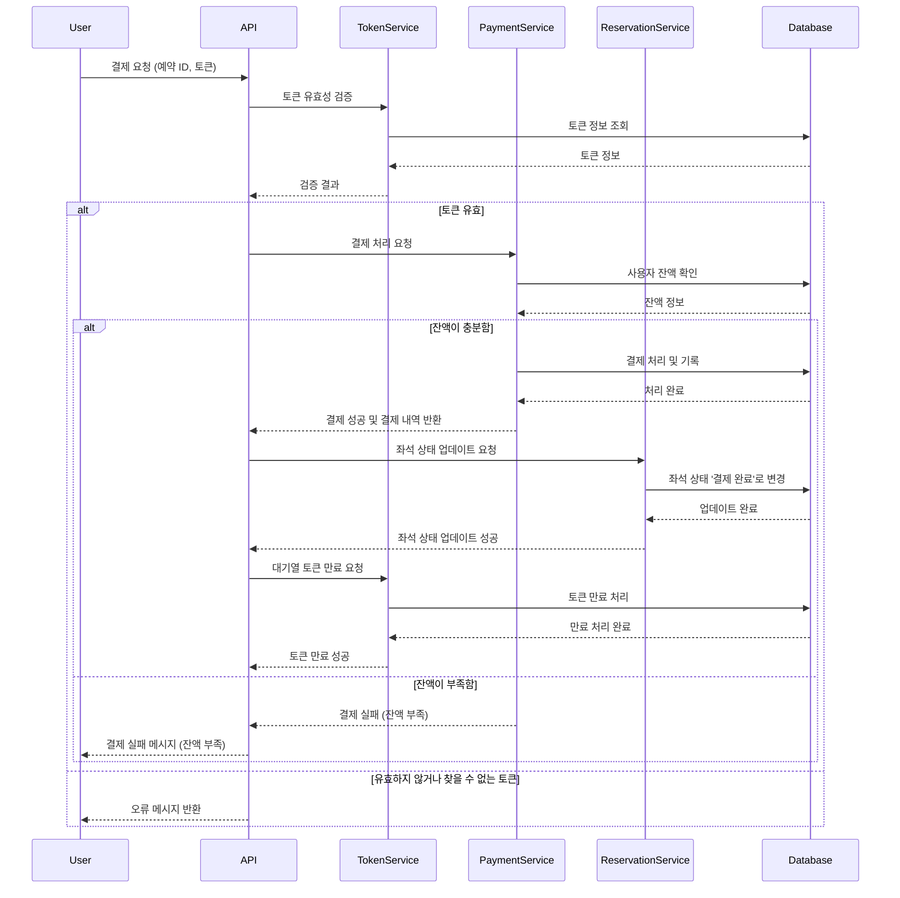
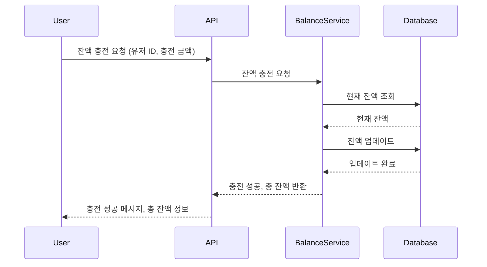
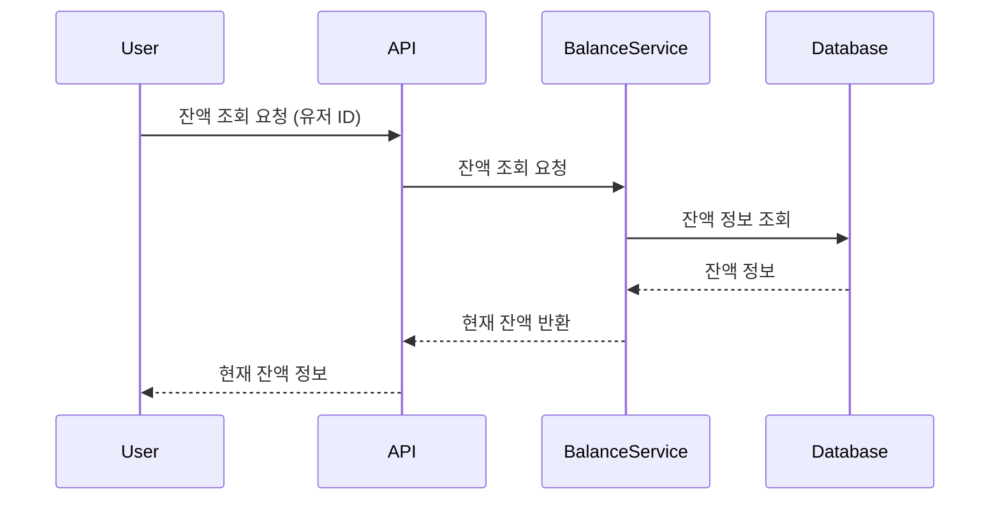

## 1. 유저 토큰 발급 

### 이벤트 시퀀스 다이어그램

### Description

유저가 콘서트 예약을 시도할 때, 토큰을 발급받습니다.

현재 대기열의 상태를 조회하고, 토큰 생성을 요청하여 DB 에 저장합니다.

생성된 토큰과 조회한 대기열의 상태 정보를 반환합니다. 

 

## 2. 유저 토큰을 통한 대기열 정보 조회

### 이벤트 시퀀스 다이어그램

### Description

토큰을 통해 대기열 정보를 조회합니다.

폴링으로 대기열을 확인하는 것을 전제합니다.

 

## 콘서트 예약 가능 날짜 목록 조회

### 이벤트 시퀀스 다이어그램

### Description
토큰이 유효한지 검사합니다.

토큰이 유효하다면, 콘서트 ID 와 날짜로 콘서트 정보를 조회합니다.

해당 콘서트가 진행되는 날짜 목록을 조회합니다.

그 중, 예약이 가능한 날짜 목록을 사용자에게 반환합니다.

토큰이 유효하지 않다면 예외를 반환합니다.

 

## 좌석 정보 조회

### 이벤트 시퀀스 다이어그램

### Description
토큰 정보와 콘서트 ID, 날짜로 좌석 정보를 조회합니다.

토큰이 유효하다면, 해당 콘서트가 열리는 날짜의 예약 가능한 좌석을 조회합니다.

사용자에게 예약 가능한 좌석 정보를 반환합니다.

좌석은 1 ~ 50 으로 제한되어 있습니다.

 

## 좌석 예약

### 이벤트 시퀀스 다이어그램

### Description
콘서트 ID, 날짜, 좌석 번호 정보로 좌석을 예약합니다.

좌석이 예약이 가능하다면 예약 정보를 저장하고, 좌석 상태를 점유상태로 변경합니다.

점유 후 결제 프로세스를 진행합니다.

결제 프로세스는 별도로 진행하며, 점유 후 5분이 지난다면 별도의 스케쥴러를 통해 점유를 해제합니다.

좌석이 예약 불가능하다면 예약 실패 메세지를 유저에게 반환합니다.

 

## 결제

### 이벤트 시퀀스 다이어그램

### Description
좌석 예약에 이어 결제를 진행합니다.

결제에 성공하면 좌석의 상태를 결제 완료로 변경합니다.

또한, 대기열 토큰을 만료 시킵니다.

 

## 잔액 충전

### 이벤트 시퀀스 다이어그램

### Description
잔액 충전은 대기열 토큰 검증이 불필요합니다.

잔액 충전이 성공하면 총 잔액을 반환합니다.

 

## 잔액 조회
### 이벤트 시퀀스 다이어그램

### Description
유저의 현재 잔액을 조회합니다.

