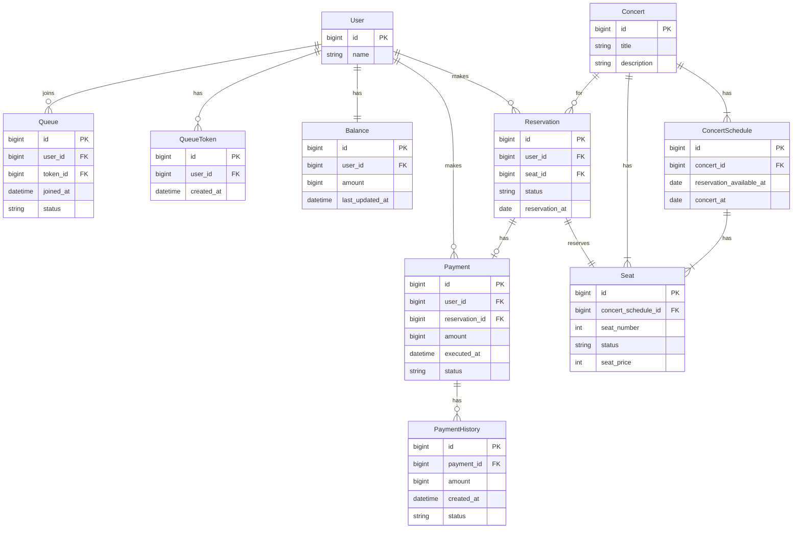

```mermaid
erDiagram
    User ||--o{ Reservation : makes
    User ||--o{ Payment : makes
    User ||--|| Balance : has
    User ||--o{ QueueToken : has
    User ||--o{ Queue : joins
    Concert ||--|{ ConcertSchedule : has
    Concert ||--|{ Seat : has
    Concert ||--o{ Reservation : for
    ConcertSchedule ||--|{ Seat : has
    Reservation ||--|| Seat : reserves
    Reservation ||--o| Payment : has
    Payment ||--o{ PaymentHistory : has

    User {
        bigint id PK
        string name
    }

    Concert {
        bigint id PK
        string title
        string description
    }

    ConcertSchedule {
        bigint id PK
        bigint concert_id FK
        date reservation_available_at
        date concert_at
    }

    Seat {
        bigint id PK
        bigint concert_schedule_id FK
        int seat_number
        string status
        int seat_price
    }

    Reservation {
        bigint id PK
        bigint user_id FK
        bigint seat_id FK
        string status
        date reservation_at
    }
    
    Balance {
        bigint id PK
        bigint user_id FK
        bigint amount
        datetime last_updated_at
    }

    QueueToken {
        bigint id PK
        bigint user_id FK
        datetime created_at
    }

    Queue {
        bigint id PK
        bigint user_id FK
        bigint token_id FK
        datetime joined_at
        string status
    }

    Payment {
        bigint id PK
        bigint user_id FK
        bigint reservation_id FK
        bigint amount
        datetime executed_at
        string status
    }

    PaymentHistory {
        bigint id PK
        bigint payment_id FK
        bigint amount
        datetime created_at
        string status
    }
```

